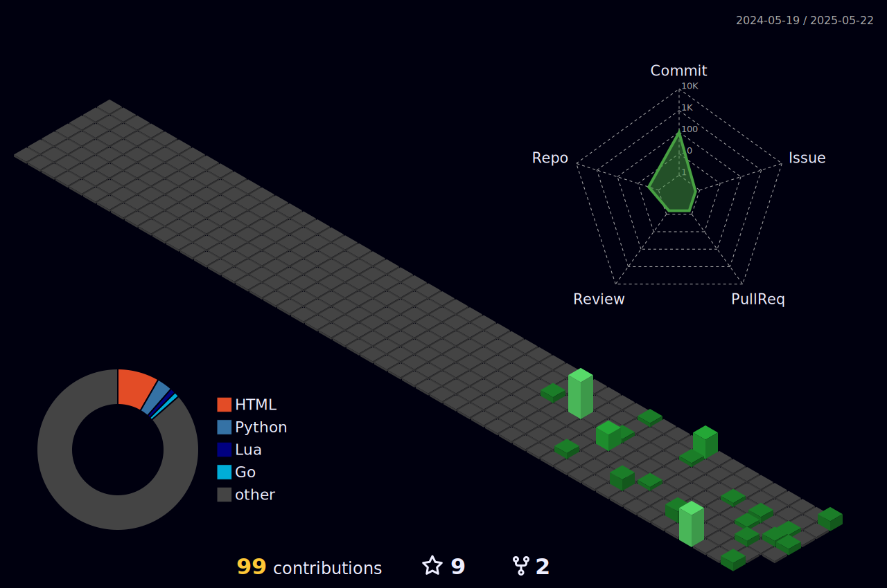

# Hello, I’m Augusto 👋 

I craft **scalable, efficient backend systems** with a focus on **performance, simplicity, and clean architecture**. My work is driven by a passion for creating solutions that are not only robust but also elegant and easy to maintain.

``` bash
~> finger augusto  
Login: augusto                           Name: Augusto Morales  
Directory: /home/augusto                 Shell: /usr/bin/zsh  
Last login: Fri Oct 20 14:30:00 2023 from 192.168.1.1  
Mail: mail@augustomorales.com            Plan: Learning \o/

---

~> cat ~/.plan  
- Learning Kubernetes for advanced orchestration.  
- Exploring GraphQL for API optimization.  
- Contributing to open-source projects.  
- Writing technical blogs about backend engineering.  


```
 
[](your-linkedin-profile)
[](mailto:augustodevelop.py@gmail.com)
[](https://www.threads.net/@augusst_morales)
[](https://www.youtube.com/@AugusstMorales)


 


