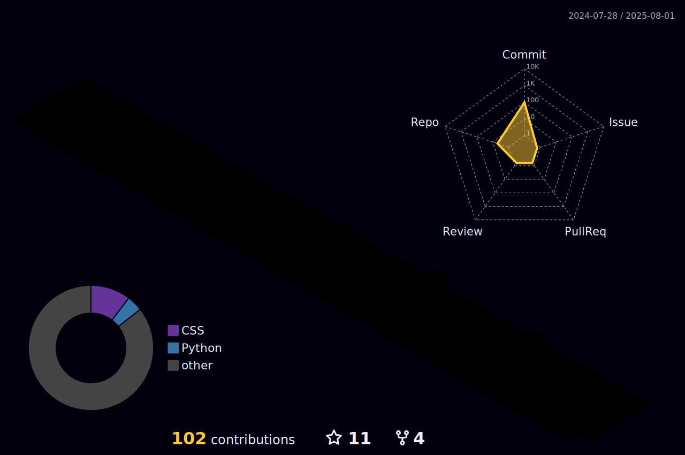

# Hello, my name is August 

I am a backend developer passionate about building scalable, efficient, and maintainable systems. With expertise in **Python**, **Go**, and **Next.js**, I specialize in designing robust backend architectures and automating workflows to deliver high-performance solutions. I am constantly refining my skills and adopting best practices to ensure every project I work on adds tangible value.

On [**@GitHub**](https://github.com), you'll find a collection of projects showcasing my work with **Python**, **Go**, and **Next.js**, as well as automation scripts optimized for **Linux** and **Mac** environments. These projects reflect my commitment to clean code, scalability, and innovative problem-solving.

I believe in the power of open collaboration and continuous learning. If you're interested in exploring new approaches, contributing to existing projects, or collaborating on something new, feel free to fork my repositories, open issues, or submit pull requests. Let's build something impactful together!

---

### Technologies I work with:
- **Backend Development**: Python, Go, Node.js
- **Frameworks**: Next.js, Flask, Express, React.js
- **Automation & DevOps**: Bash scripting & Docker
- **Databases**: PostgreSQL, MongoDB, MySQL
- **Cloud Platforms**: Azure

 

**Let's connect and collaborate!**  
   
