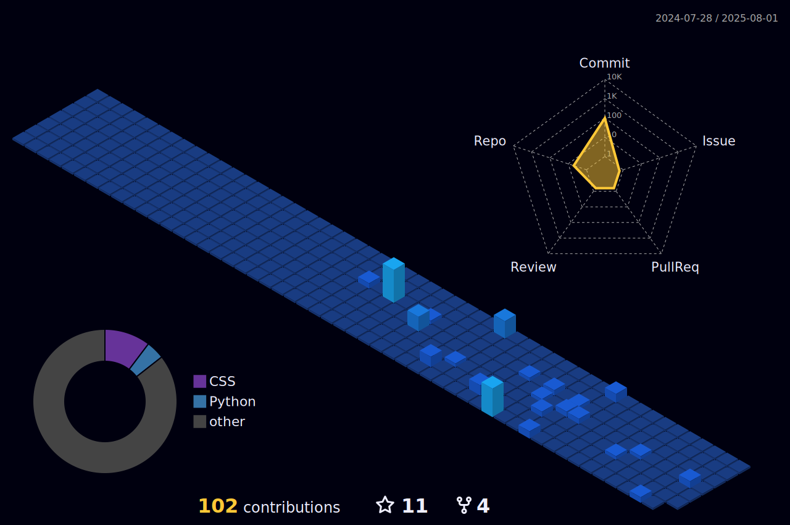

[](https://www.threads.net/@augusst_morales)
[](https://www.instagram.com/augusst_morales/)
[](https://www.linkedin.com/in/augusstmorales/)


``` zsh
~> whoami
augusstmorales

~> finger augusstmorales
Login: augusstmorales              Name: Augusto Morales
Directory: /home/augusstmorales    Shell: /bin/zsh
Last login: Sat Apr 26 20:31:00 2025 from 192.168.1.42
Mail: augustodevelop.py@gmail.com
Focus: Building elegant systems with clarity.

---

~> echo $PLAN
Create. Refine. Evolve. — Python · Lua · Go


```


If this journey inspires you, join me. Fork a project, contribute an idea, or leave a star to fuel the spark.

 


