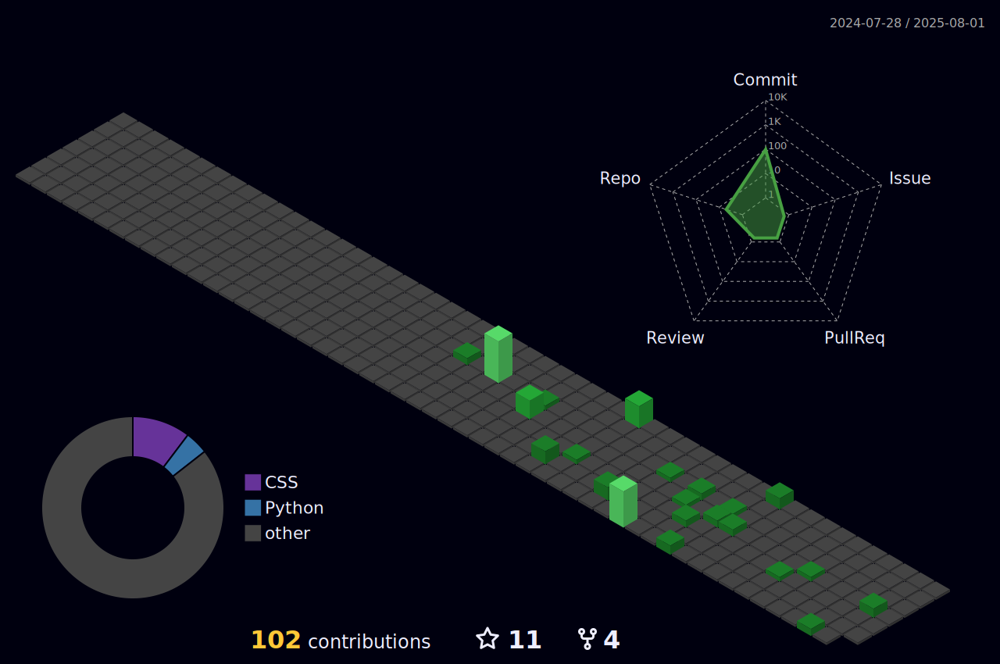

# Hello, I’m Augusto 👋 

I craft **scalable, efficient backend systems** with a focus on **performance, simplicity, and clean architecture**. My work is driven by a passion for creating solutions that are not only robust but also elegant and easy to maintain.

``` bash
~> finger augusto  
Login: Augusto                           Name: Augusto Morales  
Directory: /home/augusto                 Shell: /usr/bin/zsh  
Project:  
  - Building scalable backend systems  
  - Automating workflows with precision  
  - Exploring the elegance of macOS and Linux  
Plan:  
  Learning \o/  

---


``` 

 

I’m always open to new ideas and opportunities. Let’s connect and build something impactful together.

[](your-linkedin-profile)
[](mailto:augustodevelop.py@gmail.com)
[](https://www.threads.net/@augusst_morales)
[](https://www.youtube.com/@AugusstMorales)


